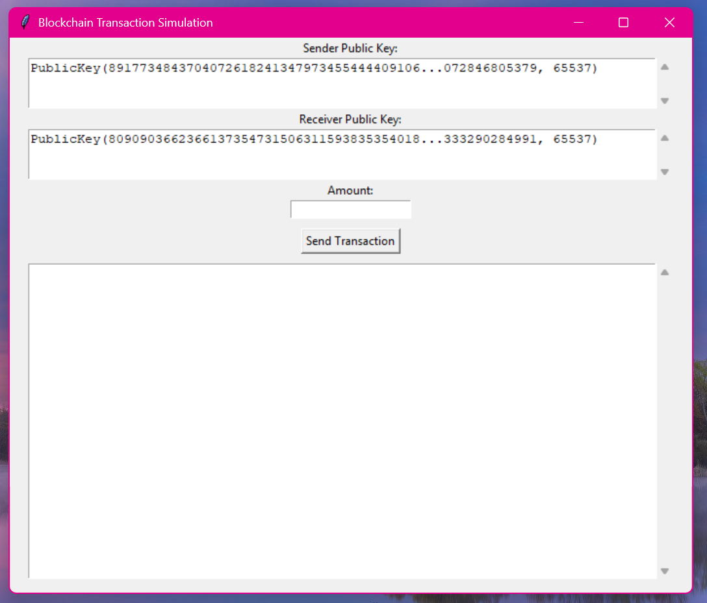
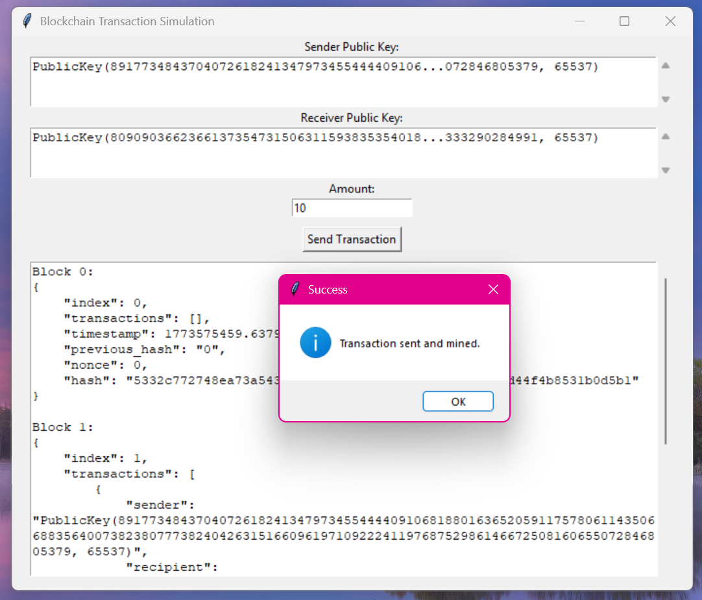
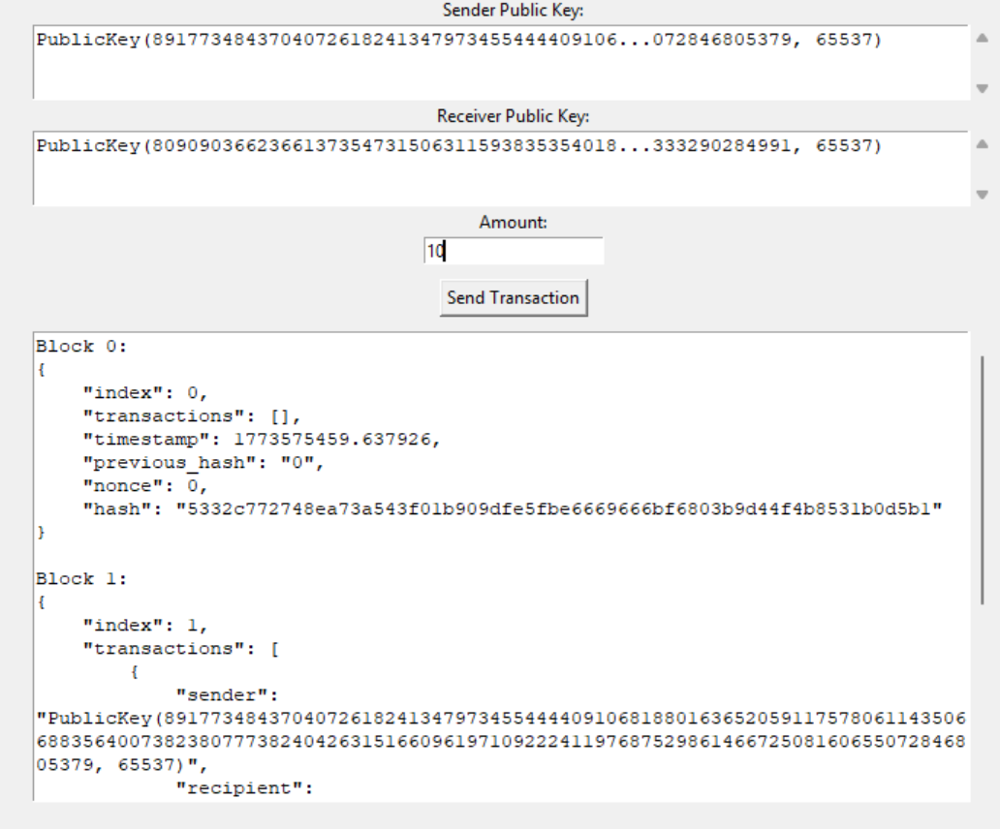

# Python Blockchain Simulator

A simple blockchain transaction simulator built in **Python** with **RSA digital signatures** and a **Tkinter GUI**.

---

## Features

- Basic blockchain implementation
- Proof-of-work mining
- RSA wallet signatures
- Transaction verification
- Simple GUI built with Tkinter
- Unit tests included

---

## Project Structure

```
python-blockchain-simulator
│
├ app
│   ├ gui.py
│   └ main.py
│
├ src
│   ├ __init__.py
│   ├ blockchain.py
│   └ wallet.py
│
├ tests
│   └ test.py
│
├ screenshots
│
├ requirements.txt
└ README.md
```

---

## Installation

Clone the repository:

```
git clone https://github.com/srabuzied/python-blockchain-simulator.git
cd python-blockchain-simulator
```

Install dependencies:

```
pip install -r requirements.txt
```

---

## Run the Program

```
python -m app.gui
```

This will launch the blockchain simulator GUI.

---

## Example

The application allows sending signed transactions and mining blocks.

Example mined block:

```
{
  "index": 1,
  "transactions": [
    {
      "sender": "...",
      "recipient": "...",
      "amount": 10
    }
  ],
  "nonce": 641,
  "hash": "00b615..."
}
```

---

### GUI







---

## License

MIT License
